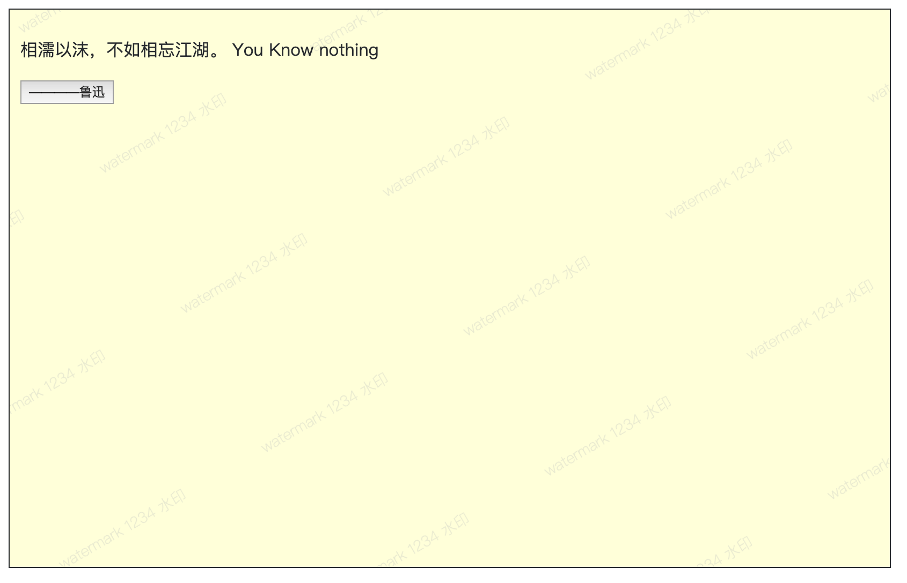

# 水印




## 使用示例

> browser: `window.Watermark`

```js
import { getWatermark, setWatermark } from '@jonge/watermark';

// 通过方法获取{生成的图片，建议图片大小}
const content = '水印测试1234';
const { backgroundImage, backgroundSize, dataUrl } = getWatermark({ content });
// backgroundImage: url(dataUrl)
// backgroundSize: 10px 20px
// dataUrl: "data:image/png;base64;xxxxxxxx"

// 指定挂载容器，设置水印，并开启防篡改
setWatermark({
  content: 'watermark 1234 水印',
  mountEl: this.refs.el as HTMLElement,
  marginLeft: 120,
  marginTop: 200,
  antiHack: true,
  styles: {
    fontWeight: '200',
    backgroundColor: 'lightyellow'
  },
});
```

## API

- `function getWatermark(config: WatermarkConfig) {}`
- `function getWatermark(config: DomWatermarkConfig) {}`

### `WatermarkConfig` 属性

| 属性名       | 类型   | 说明                           | 是否必填 | 默认值                                     |
| ------------ | ------ | ------------------------------ | -------- | ------------------------------------------ |
| `type`       | string | 水印类型：`svg`，`canvas`      | N        | `canvas`                                   |
| `content`    | string | 水印内容                       | Y        |                                            |
| `rotate`     | number | 旋转角度（顺时针正，逆时针负） | N        | -30                                        |
| `marginTop`  | number | 垂直间距                       | N        | 48                                         |
| `marginLeft` | number | 水平间距                       | N        | 60                                         |
| `color`      | string | 文字颜色                       | N        | `rgba(191, 195, 199, 0.3)`                 |
| `fontSize`   | number | 文字大小                       | N        | `14`                                       |
| `fontFamily` | string | 字体                           | N        | `"PingFang SC,Microsoft YaHei,sans-serif"` |

### `DomWatermarkConfig` 属性

除 `WatermarkConfig` 中的属性外，还有

| 属性名  | 类型            | 说明                                        | 是否必填 | 默认值        |
| ------- | --------------- | ------------------------------------------- | -------- | ------------- |
| styles  | StyleSheet 对象 | 自定义水印字体样式，水印容器 zIndex、背景等 | N        |               |
| mountEl | HTMLElement     | 水印挂载容器                                | N        | document.body |

## 开发者

```shell
# 启动示例
yarn storybook

```
